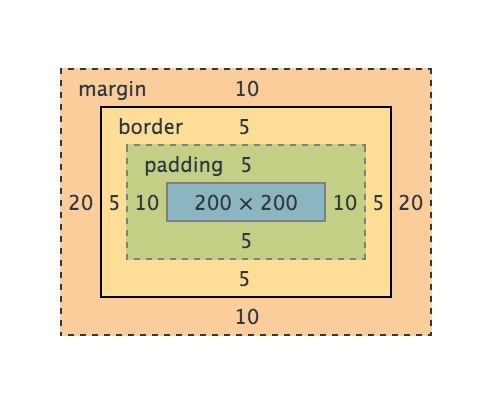

# 盒模型
页面上显示的每个元素（包括内联元素）都可以看作一个盒子，即盒模型( box model )。请看Chrome DevTools 里的截图：    


盒模型由 4 部分组成。从内到外分别是
```css
content -> padding -> border -> margin
```

## 盒模型占的空间计算规则
不同的盒模型占的空间计算规则是不一样的。

盒模型的默认类型是 content-box。占的宽度为 水平方向的 border，padding 值 加 width，占的高度为 垂直方向的 border，padding 值 加 height。

盒模型的另一个类型是 border-box。占的宽度为 width，占的高度为 height。


## 设置盒模型
用 box-sizing 来设置盒模型。 如
```css
box-sizing: border-box;
```

## margin
外边距。

margin 属性包括

* margin-left
* margin-right
* margin-top
* margin-bottom
* margin: 简写。如

```css
margin: 2em          /* all margins set to 2em */
margin: 1em 2em      /* top & bottom = 1em, right & left = 2em */
margin: 1em 2em 3em  /* top=1em, right & left = 2em, bottom=3em */
margin: 1em 2em 3em 4em  /* top=1em, right=2em, bottom=3em, left=4em */
```

### margin 折叠
#### 折叠规则
* 垂直相邻的 margin 才有可能折叠，水平 margin 永远不折叠
* 根元素（即 html 元素）的 margin 永远不折叠
* 如果一个元素，它的 top margin 和 bottom margin 是相邻的，并且有清除浮动后的空隙（clearance），这个元素的 margin 可以跟兄弟元素的 margin 折叠，但是折叠后的 margin 不能跟父元素的 bottom margin 折叠。

#### 折叠后的 margin 大小
* 如果 margin 都是正数，则取他们当中的最大值
* 如果 margin 中有正有负，则取最大的正数加上最小的负数（如最大的 margin 是 20px，最小的 margin 是 -20px，则他们计算后的值是 0）
* 如果 margin 中都是负数，则取他们当中的最小值

### 注意点
* margin-top 和 margin-bottom 值对行内非替换元素（non-replaced inline element， 如img）是无效的。
* 如果 margin 的值是百分比，则是相对于父元素的内容盒宽度来计算的，即使 margin-top 和 margin-bottom 也是如此。

## 参考
* [CSS 最核心的几个概念](http://www.jianshu.com/p/3a18fcd9fcda?search_token=079525c515d193f008c9963224ab3a325b80f147b50ce129113c3a88f75b8bfa)
* [细说 CSS margin](https://blog.coding.net/blog/css-margin)
* [CSS 2.1 规范](http://www.ayqy.net/doc/css2-1/box.html#box-dimensions)
